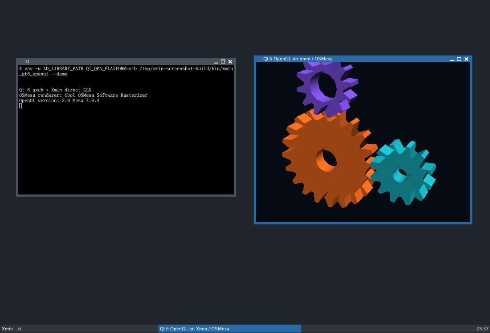

# Xmin

Xmin is a small, self-contained, software-only X11 server for headless testing
and isolated desktop sessions.
It is a full C++17 fork built around the X11 wire contract—not a reduced Xorg
build. It has one virtual screen, deterministic software rendering, fixed
virtual input devices, authenticated local sockets, and no hardware or driver
stack.  GPT 5.6 and Codex have been used to do the heavy lifting.



The server links only the platform C/C++ runtime, math, and a private static
pixman. It does not load Xorg, X11, XCB, font, GL, crypto, DRM, or GPU
driver libraries. Optional OpenGL is a separate client-side `libGL.so.1` backed
by OSMesa; the server does not advertise indirect GLX and never links OSMesa.

## Quick start

```sh
cmake --preset dev
cmake --build --preset dev
ctest --preset dev

./build/dev/bin/xmin-run \
  --server ./build/dev/bin/Xmin -- your-x11-program
```

Build-tree executables are collected in `build/dev/bin`, and libraries and
archives in `build/dev/lib`.

`xmin-run` reserves a display, writes a private MIT-MAGIC-COOKIE-1 authority
file, starts Xmin, exports `DISPLAY` and `XAUTHORITY`, supervises the requested
program, and cleans up sockets, locks, and credentials.

Automation and capture are built in:

```sh
xminctl list-windows
xminctl click "Window title" 40 30
xminctl type "hello"
xminctl wait-stable "Window title"
xminctl capture-window "Window title" window.ppm
xminctl capture-root root.ppm
```

The controller contains its own focused X11 transport and protocol codec. It
does not link Xlib, XCB, or Xau.

Optional client SDKs provide similarly focused C++17 XCB/xkbcommon and
Xlib/Xft compatibility surfaces for patched Qt, FLTK, and Tk. Toolkit fonts
are rendered through struetype from embedded Go Sans and Go Mono regular,
bold, italic, and bold-italic faces; no system font discovery or font runtime
library is used. These SDKs never become server dependencies. The default Unix
interactive build enables the toolkit surface for JWM and st; server-only
presets keep it disabled.

## Interactive desktop

For the complete desktop and GLFW viewer demo, run:

```sh
./launch.sh
```

It uses `.build` when that tree has the desktop binaries, otherwise
`build/dev`; `--build-dir`, `--screen`, `--fps`, and `--no-shm` provide the
common overrides. Closing the viewer ends the demo session and cleans up its
temporary descriptor.

The desktop session and host viewer remain separate programs. To keep a
session alive while detaching and reattaching viewers, start it manually in
one terminal:

```sh
./build/dev/bin/xmin-session \
  --session-info /tmp/xmin-session.info
```

Then attach the host window from another terminal:

```sh
./build/dev/bin/xmin-viewer \
  --session-info /tmp/xmin-session.info
```

The viewer uses DAMAGE-driven partial-frame capture, preserving disjoint dirty
rectangles so a tray update never forces a full desktop read. MIT-SHM is used
when available, with bounded tiled `GetImage` and rate-limited polling
fallbacks. Closing it does not end the desktop. The JWM menu opens
with a left click on the dark-grey desktop (or Alt-F1); `xmin-st` is available
there but is not started automatically. Sessions prefer the bundled `xmin-sh`
and embedded Go Mono font when those targets are enabled. The session
descriptor and private authority data are removed when the session exits.

Terminal windows have a six-pixel resize border; right-clicking the title bar
also exposes JWM's Resize action. In `xmin-st`, use `Ctrl+Shift++` to enlarge
the font, `Ctrl+Shift+-` to shrink it, and `Ctrl+Shift+0` to restore the default.
`Ctrl` plus the mouse wheel also adjusts the font size.

## Product profile

Xmin implements all 127 core opcode slots, including correct reserved-opcode
errors, plus 383 requests across the declared extension contract:

- Generic Event, SHAPE, BIG-REQUESTS, SYNC, XC-MISC, XTEST;
- RENDER, RANDR, XFIXES, DAMAGE, Composite, Present;
- XKEYBOARD, XI2 and the compact XI1 compatibility view;
- DOUBLE-BUFFER, MIT-SCREEN-SAVER, and single-screen XINERAMA; and
- MIT-SHM where SysV shared memory is available.

The exact versions, request-level status, display formats, transport,
authentication, and CLI contract are generated from
`profiles/protocol.json`. Configure rejects stale coverage output.

The deliberate scope is equally important: one screen/output/CRTC, a 24-bit
TrueColor root, pixmap depths 1/4/8/24/32, local Unix sockets, fixed US keyboard,
and software raster only. There is no TCP, multi-screen, physical input,
hotplug, DDX/module ABI, DRI/DRM, GPU Present, server-side GLX, EGL, Vulkan,
XVideo, XDMCP, runtime font path, runtime XKB database, or server reset cycle.

## Architecture

One `ServerState` owns clients, resources, windows, selections, input, timers,
and extension state. One bounds-checked wire reader/writer handles native and
opposite-endian clients. Typed resource variants replace Xorg resource types
and private slots. Window and pixmap surfaces use one pixman-backed renderer,
one region model, one damage path, and one input/event path.

The source is under `src/server`; the launcher and controller reuse its narrow
platform/authentication library. `DESIGN.md` documents the invariants and
dependency direction.

## Verification

The normal suite uses raw native/opposite-endian clients and independent host
XCB clients. It covers authentication, malformed framing, concurrency,
lifecycle cleanup, all core and extension groups, raster readback, controller
automation, XKB through xkbcommon, optional software GL, install relocation,
and installed dependency auditing. Optional Qt 5/6 and GTK 3 acceptance tests
are discovered only for tests; they never become product dependencies.

Useful gates:

```sh
cmake --preset minimal   # release, server profile, no client GL
cmake --build --preset minimal
ctest --preset minimal

cmake --preset sanitizer
cmake --build --preset sanitizer
ctest --preset sanitizer
```

For the seeded full-desktop lifecycle workload, run both viewer capture paths:

```sh
xvfb-run -a tests/desktop_stress.sh --build-dir .build --seed 1
xvfb-run -a tests/desktop_stress.sh --build-dir .build --seed 1 --no-shm
```

It mixes guest geometry and map state, resizes the GLFW host window, cycles
terminal processes, detaches and reattaches the viewer, then checks input and
capture. `--resize-only` is available for narrow regression bisection.

See `BUILDING.md` for options, installation, and dependency refreshes. The
completed fork plan and measured outcome are recorded in `modernize.txt`.
